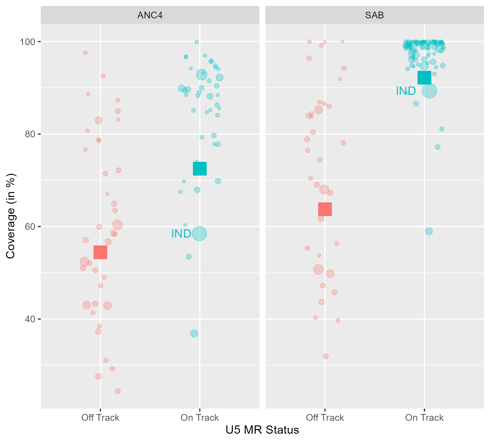

  
The below graph shows the percentage of women (aged 15-49 years) attended at least four times during pregnancy by any provider (ANC4), and the percentage of deliveries (of women 15-49) attended by skilled health personnel (SAB). The dot size is relative to the [UN estimated number of births in 2022](https://github.com/unicef-drp/UNICEF-P3-assessment-public/blob/main/01_rawdata/WPP2022_GEN_F01_DEMOGRAPHIC_INDICATORS_COMPACT_REV1.xlsx).

Data is sourced from the [UNICEF Global Data Repository](https://data.unicef.org/resources/data_explorer/unicef_f/?ag=UNICEF&df=GLOBAL_DATAFLOW&ver=1.0&dq=.MNCH_ANC4+MNCH_SAB.&startPeriod=2018&endPeriod=2022), covering the most recent information available between 2018 and 2022. The data is grouped into "on track" and "off track" categories based on the [UN estimated under 5 mortality rate](https://github.com/unicef-drp/UNICEF-P3-assessment-public/blob/main/01_rawdata/On-track%20and%20off-track%20countries.xlsx). The graph also shows the group mean for each indicator, weighted by the estimated number of births.

```{r plot, echo=FALSE, out.width='80%'}
# List packages that we need
pkgs <- c("knitr")

# Check they are installed
pkgs_2_install <- pkgs[!(pkgs %in% installed.packages())]

# Install if not on system
for (pkg in pkgs_2_install) {
  install.packages(pkg)
}

# Load packages
for (pkg in pkgs) {
  library(pkg,character.only=TRUE)
}

# Display the plot from the specified file path

```

On average, “On track” countries score higher on both indicators compared to “Off track” countries. However, “Off track” countries show greater variability in their results for both indicators. SAB coverage is highly concentrated among “On track” countries, while ANC4 coverage is somewhat more dispersed. The large size of India skews the averages downward in both cases.

Note that this analysis is based on a limited dataset. Of the 200 countries monitored for U5MR status, data is available for only 142 countries (approximately 70%, evenly split between “On track” and “Off track”). Furthermore, only 73 countries have data for both indicators: 8 lack SAB data, and 61 lack ANC data.
