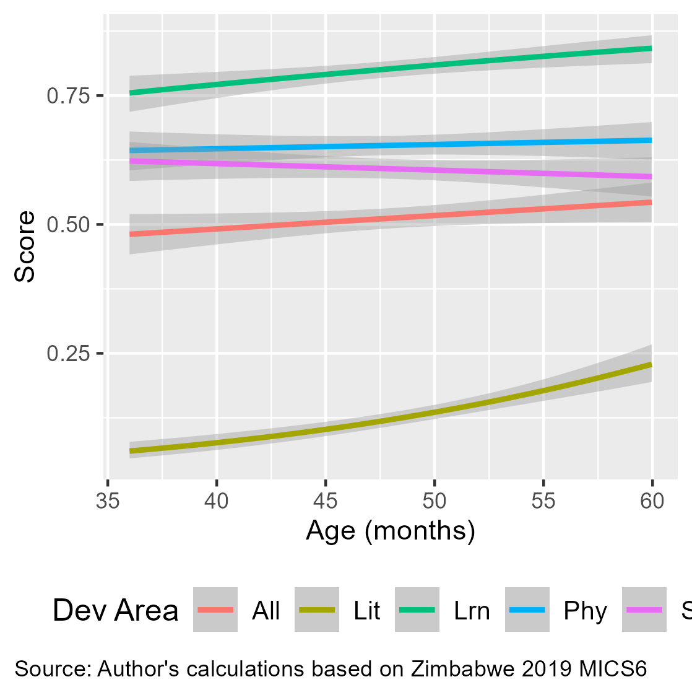
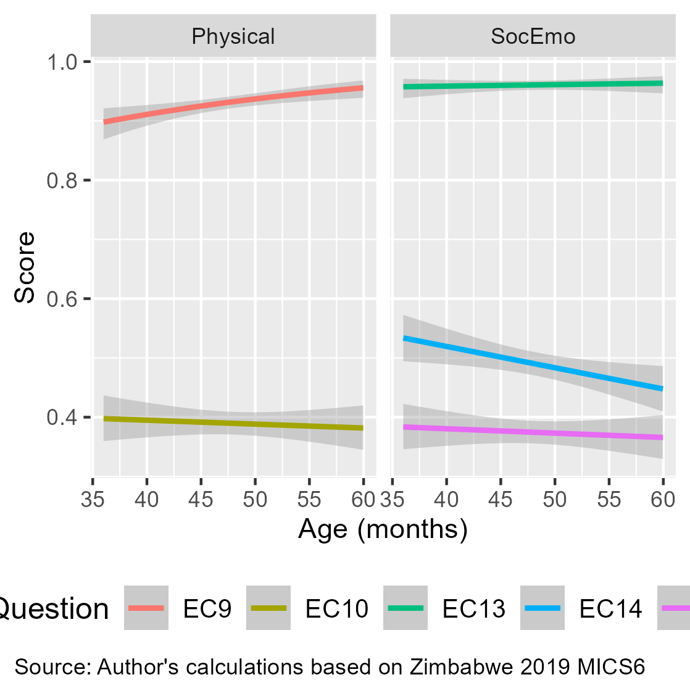

  
# Disclaimer
  
  This exercise uses limited data. Task 2 requires not only technical analysis but also interpretation of the “important message” or “interesting finding.” The current data may not be representative; the analysis assumes the sample is representative.

# Children in Zimbabwe Reach Developmental Milestones but Face Challenges

MICS data from over 2,500 children aged 36 to 60 months, collected from mothers and caregivers, shows progress in developmental milestones along with some issues. The analysis includes 10 yes/no questions across four areas: Literacy and Maths, Physical Development, Learning, and Socio-emotional Development. These questions are converted into indices ranging from 0 (no to all) to 1 (yes to all).

Figure 1 illustrates the predicted regression values of scores against the children's age in months.[^1] The lines represent estimates, and the grey shading indicates uncertainty, which increases at the edges where fewer data points are available.
  
```{r plot, echo=FALSE, out.width='65%', fig.cap="Overall Developmental Scores", fig.align='center'}
# List packages that we need
pkgs <- c("knitr")

# Check they are installed
pkgs_2_install <- pkgs[!(pkgs %in% installed.packages())]

# Install if not on system
for (pkg in pkgs_2_install) {
  install.packages(pkg)
}

# Load packages
for (pkg in pkgs) {
  library(pkg,character.only=TRUE)
}

# Display the plot from the specified file path

```

The lines for Learning (Lrn) and Literacy (Lit) show increasing trends, with Learning progressing linearly and Literacy more exponentially. The overall trend (All), based on all answers, also shows an upward trajectory, indicating overall developmental improvement. However, Physical Development (Phy) remains flat, and Socio-emotional Development (SnE) shows a downward trend.

Figure 2 explores individual questions related to Physical (EC9 and EC10) and Socio-emotional Development (EC13, EC14, and EC15). The ability to pick up small objects (EC9) is developing as expected, but there is no improvement in the frequency of illness (EC10).[^2]

```{r echo=FALSE, out.width='65%', fig.cap = "Physical and Socio-Emotional Scores", fig.align='center'}
# Display the plot from the specified file path

```


The decline in Socio-emotional Development appears driven by the frequency of aggressive behaviors like kicking, biting, or hitting (EC14). Other questions related to getting along with others (EC13) and distractibility (EC15) show stable results despite the uncertainty.[^3]

[^1]: A general lineal model with a binomial link function was regressed on age in months.
[^2]: Improved sickness frequency might be positive, but this warrants further review by a domain expert. The lack of improvement in developmental milestones should be validated.
[^3]: Further expertise is needed to interpret the socio-emotional decline. It may reflect an inverse U-curve: younger children may initially exhibit aggressive behaviors but later develop self-control.  
  